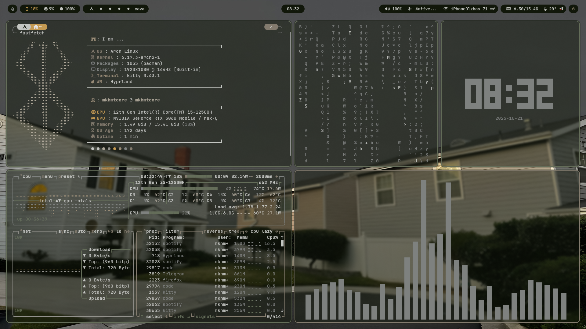

# Hyprland Rice

Welcome to my Hyprland Rice configuration! This setup is designed to provide a clean, efficient, and visually appealing desktop environment.

## Dependencies

- **Window Manager**: [Hyprland](https://github.com/hyprwm/Hyprland) - A dynamic tiling Wayland compositor.
- **Compositor**: Wayland for smooth and modern graphics.
- **Terminal**: [Kitty](https://sw.kovidgoyal.net/kitty/) - A fast, feature-rich, GPU-based terminal emulator.
- **Launcher**: [Wofi](https://hg.sr.ht/~scoopta/wofi) - A Wayland-native application launcher.
- **Bar**: [Waybar](https://github.com/Alexays/Waybar) - A highly customizable status bar.
- **Notifications**: [Mako](https://github.com/emersion/mako) - A lightweight Wayland notification daemon.
- **Color Scheme Generator**: [Pywal16](https://github.com/adi1090x/pywal16) - A tool to generate and apply color schemes based on your wallpaper.

## Screenshots



## Installation

1. Clone this repository:
    ```bash
    git clone https://github.com/mkhmtolzhas/Invincible-Dots
    cd Invincible-Dots
    ```

2. Install the required dependencies:
    ```bash
    sudo pacman -S hyprland kitty wofi waybar mako
    yay -S python-pywal16
    ```

3. Copy the configuration files to their respective locations:
    ```bash
    cp -r .config/* ~/.config/
    ```

4. Update the Waybar configuration:
    If your Waybar configuration references a CSS file like `/home/mkhmtcore/.cache/wal/colors-waybar.css`, make sure to replace `mkhmtcore` with your actual username.

5. Restart your session and enjoy your new setup!

## Customization

Feel free to tweak the configuration files in the `~/.config` directory to suit your preferences.

Enjoy your Hyprland rice!