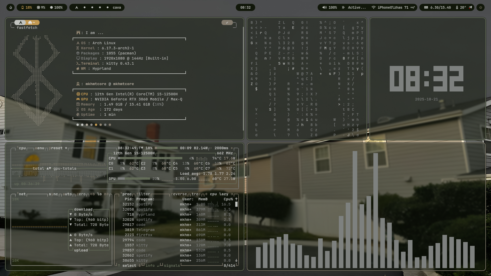

# Hyprland Rice

My Linux desktop dotfiles (`~/.config`) — a **Hyprland** setup with a custom
**Quickshell** desktop shell and **matugen** wallpaper-based theming.

## Highlights

- **Hyprland configured in Lua** (`hypr/hyprland.lua` + `hypr/configs/*.lua`),
  not the classic `.conf` syntax — needs a Hyprland build with Lua config support.
- **Custom Quickshell shell** (replaces waybar):
  - Bar on any screen edge — **top / bottom / left / right** — switchable live via
    a popup picker or hotkeys (`Super+B` to cycle, `Super+Ctrl+arrows` for a side).
  - Workspaces (vertical/horizontal to match the bar), active window, clock,
    system tray, brightness / volume / wifi / bluetooth / battery with hover
    tooltips (scroll to change volume & brightness).
  - **Network indicator** (NetworkManager via `nmcli`) — SSID + signal strength
    in the tooltip, click to open `nmtui`.
  - **Dashboard** that merges out of the bar (`Super+D` or click the clock):
    media player (Mpris) with seek, calendar, CPU/RAM/temp/disk, quick toggles
    (WiFi/BT/DND), brightness/volume sliders, power buttons.
  - Volume / brightness **OSD**, Material 3 motion animations.
  - **Localised** (follows `$LANG`; ru/en included).
- **matugen theming** — colours generated from the wallpaper for the bar,
  kitty, rofi, mako, hyprland/hyprlock, nvim and the keyboard backlight.
  Changing the wallpaper recolours everything live (`Super+W`).
- **Themed nvim** — lazy.nvim setup that builds a base16 palette from matugen
  (`base16-nvim`) and hot-reloads it on wallpaper change; falls back to
  catppuccin-mocha when no matugen palette exists yet.
- pywal16 kept only for Firefox (pywalfox) and Discord.

## Included Configs

- `btop`
- `cava`
- `fastfetch`
- `hypr`
- `keyboard` (Lenovo Legion RGB backlight, themed from matugen)
- `kitty`
- `mako`
- `matugen`
- `nvim`
- `quickshell`
- `rofi`
- `screen`
- `wallpapers`

## Dependencies

- [Hyprland](https://github.com/hyprwm/Hyprland) — a version that supports the
  Lua config (`hyprland.lua`)
- [Quickshell](https://github.com/quickshell-mirror/quickshell)
- [Kitty](https://sw.kovidgoyal.net/kitty/)
- [Rofi](https://github.com/davatorium/rofi) (Wayland fork)
- [Mako](https://github.com/emersion/mako)
- [Matugen](https://github.com/InioX/matugen)
- [Pywal16](https://github.com/eylles/pywal16) (optional — Firefox/Discord)
- `awww` (swww fork) for wallpapers, `brightnessctl`, `playerctl`, `cliphist`,
  `wl-clipboard`
- `networkmanager` (`nmcli`/`nmtui`) for the bar's network indicator
- `hyprshot` for screenshots, `thunar` as the file manager (`Super+E`)
- A **JetBrainsMono Nerd Font** for the bar/terminal glyphs

## Screenshot



## Installation

1. Clone the repository:
   ```bash
   git clone https://github.com/mkhmtolzhas/mkhmtdots
   cd mkhmtdots
   ```
2. Install the required packages:
   ```bash
   sudo pacman -S hyprland kitty rofi mako btop cava fastfetch brightnessctl \
                  playerctl cliphist wl-clipboard networkmanager thunar \
                  neovim ttf-jetbrains-mono-nerd
   yay -S quickshell matugen-bin python-pywal16 awww hyprshot
   ```
3. Run the installer:
   ```bash
   chmod +x install.sh
   ./install.sh
   ```

### Installer Options

```bash
./install.sh --no-backup   # don't back up existing files
./install.sh --no-p10k     # don't install .p10k.zsh
./install.sh --no-theme    # don't generate matugen colours after install
./install.sh --delete      # remove files in managed dirs that aren't in this repo
```

## Notes

- **Theming is matugen.** It runs from the wallpaper scripts
  (`hypr/scripts/wallpapers/set.sh`, `set-wallpaper.sh`) on every wallpaper
  change and regenerates colours for quickshell, kitty, rofi, mako, hyprland,
  nvim and the keyboard. Quickshell reads colours from
  `~/.cache/quickshell-colors.json` live, so there's no reload/notification on
  wallpaper change. Running nvim instances are recoloured through their server
  socket by the matugen `nvim` template's post-hook.
- The **keyboard backlight** needs the `legion-kb-rgb` binary (Lenovo Legion).
  It is **not** shipped in this repo — drop it in `~/.config/keyboard/` or put it
  on `PATH`. Without it, `set-color-keyboard.sh` simply no-ops.
- `install.sh` installs only directories tracked in this repo and optionally
  backs up existing files to `~/.config-backups/`.
